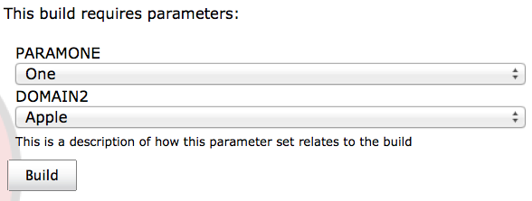
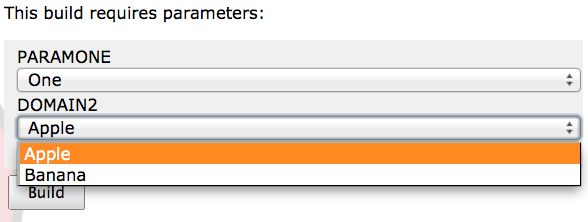
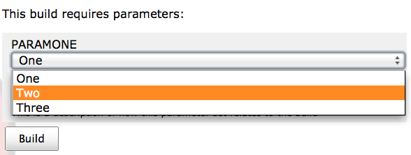
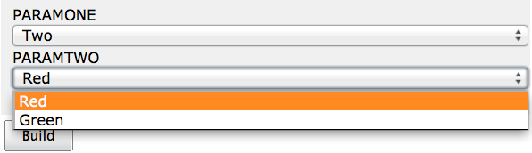

<html>
  <title>Dynamic Parameter Documentation</title>
<body>
  <h1>Overview</h1>

  
A Jenkins parameter plugin that allows for two select elements. The second select populates values depending upon the selection made for the first select.

  <h2>Configuration</h2>

  

    After installation of the dynamic parameter plugin a new parameter option will be available when configuring a job in Jenkins. 
  

  

    Configure the dynamic parameter specifying the name of the environmental variable to set with the value of each selected item, the available values for each select and a description of how the parameters relate to the build. For the second select, control which options are available based on the first select's selection by prefixing values with the first selct value and a colon. 
  

  

    The values selected during a build will be available in the parameter names specified in the configuration. 
  

  <h2>Build</h2>

  
The following screenshots show a dynamic parameter plugin in action using the configuration from the screen shots in the configuration section.

  

   Initial state: 
  

  

   Second select options based on first select value: 
  

  

   First select options: 
  

  

   Second select options based on changed first select value: 
  

</body>
</html>
